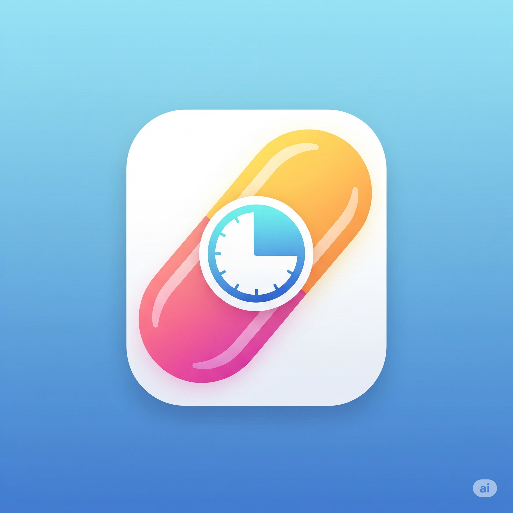

# MyMedAlert - Medicine Reminder App 💊

A modern, privacy-focused medicine reminder application built with React, Vite, and Capacitor. MyMedAlert helps you manage your medication schedule effectively while keeping your health information completely private and secure.



## ✨ Features

- **🔔 Smart Reminders**: Set up medication reminders with precise timing
- **👥 Multi-Patient Support**: Manage medications for multiple family members
- **📱 Cross-Platform**: Available on web, Android, and iOS
- **🔒 Privacy-First**: All data stored locally - no cloud, no tracking
- **📸 Medicine Photos**: Add photos to easily identify medications
- **📊 Adherence Tracking**: Track taken/missed medications
- **🔋 Refill Alerts**: Get notified when pills are running low
- **🌙 Modern UI**: Beautiful, responsive design with dark mode support

## 🚀 Technology Stack

- **Frontend**: React 18 + Vite
- **Styling**: Tailwind CSS
- **Mobile**: Capacitor for native Android/iOS apps
- **Icons**: Lucide React
- **Notifications**: Capacitor Local Notifications
- **Storage**: Browser localStorage (privacy-focused)

## 📱 Supported Platforms

- ✅ Web Browser
- ✅ Android (API 24+)
- ✅ iOS (coming soon)

## 🔧 Development Setup

### Prerequisites

- Node.js 18+ 
- npm or yarn
- Android Studio (for Android development)
- Xcode (for iOS development - macOS only)

### Installation

1. **Clone the repository**
   ```bash
   git clone https://github.com/YOUR_USERNAME/mymedalert.git
   cd mymedalert
   ```

2. **Install dependencies**
   ```bash
   npm install
   ```

3. **Start development server**
   ```bash
   npm run dev
   ```

4. **Build for production**
   ```bash
   npm run build
   ```

### Mobile Development

#### Android Setup

1. **Build web assets**
   ```bash
   npm run build
   ```

2. **Sync with Capacitor**
   ```bash
   npx cap sync android
   ```

3. **Open in Android Studio**
   ```bash
   npx cap open android
   ```

#### iOS Setup (macOS only)

1. **Build web assets**
   ```bash
   npm run build
   ```

2. **Add iOS platform**
   ```bash
   npx cap add ios
   ```

3. **Sync with Capacitor**
   ```bash
   npx cap sync ios
   ```

4. **Open in Xcode**
   ```bash
   npx cap open ios
   ```

## 📄 Privacy Policy

MyMedAlert is built with privacy as a core principle:

- **No Data Collection**: We don't collect any personal information
- **Local Storage Only**: All your medication data stays on your device
- **No Cloud Sync**: Your health information never leaves your device
- **No Tracking**: No analytics, ads, or third-party services

For complete privacy details, see our [Privacy Policy](src/PrivacyPolicy.jsx).

## 🛠️ Project Structure

```
pill-reminder/
├── src/
│   ├── assets/              # Images and static assets
│   ├── MedicineReminderApp.jsx  # Main application component
│   ├── PrivacyPolicy.jsx    # Privacy policy page
│   ├── App.jsx              # App entry point
│   ├── main.jsx             # React entry point
│   └── index.css            # Global styles
├── android/                 # Android Capacitor project
├── public/                  # Public assets
├── capacitor.config.json    # Capacitor configuration
├── package.json             # Dependencies and scripts
└── README.md               # This file
```

## 📱 Key Components

- **MedicineReminderApp**: Main application logic and UI
- **PrivacyPolicy**: Comprehensive privacy policy component
- **Local Notifications**: Cross-platform notification system
- **Data Management**: Local storage with data persistence

## 🔐 Security Features

- **Local-First Architecture**: All data stored on device
- **No Network Requests**: App works completely offline
- **Secure Storage**: Uses browser security standards
- **Data Encryption**: Browser-level encryption for stored data

## 📋 Available Scripts

- `npm run dev` - Start development server
- `npm run build` - Build for production
- `npm run preview` - Preview production build
- `npm run lint` - Run ESLint

## 🤝 Contributing

1. Fork the repository
2. Create a feature branch (`git checkout -b feature/amazing-feature`)
3. Commit your changes (`git commit -m 'Add amazing feature'`)
4. Push to the branch (`git push origin feature/amazing-feature`)
5. Open a Pull Request

## 📞 Support

- **Email**: balivishnu.cs@gmail.com
- **Response Time**: We aim to respond within 48 hours
- **GitHub Issues**: Use GitHub issues for bug reports and feature requests

## 📜 License

This project is licensed under the MIT License - see the [LICENSE](LICENSE) file for details.

## 🙏 Acknowledgments

- Built with ❤️ using React and Capacitor
- Icons by [Lucide](https://lucide.dev)
- UI components inspired by modern design principles
- Privacy-first approach inspired by user trust

---

**Note**: MyMedAlert is designed for medication reminders only and should not replace professional medical advice. Always consult healthcare professionals for medical decisions.
